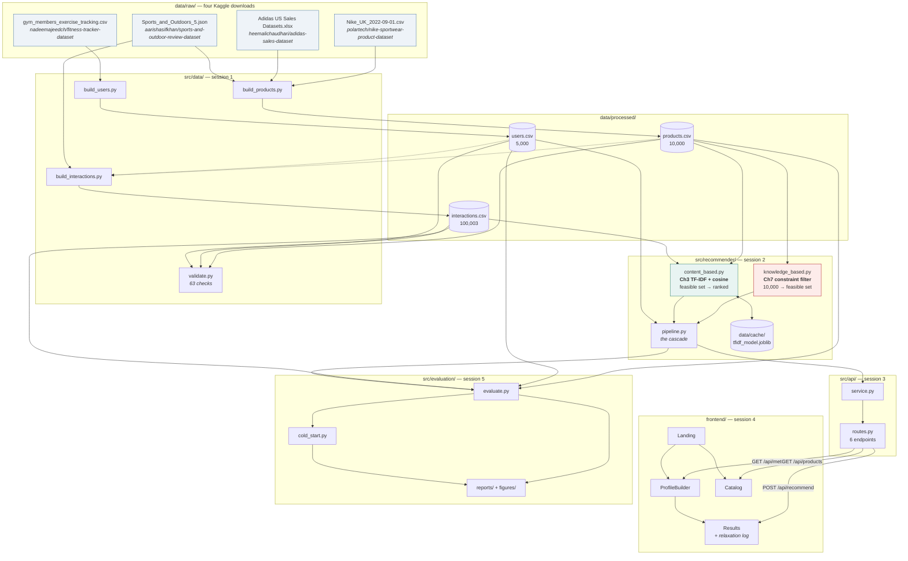
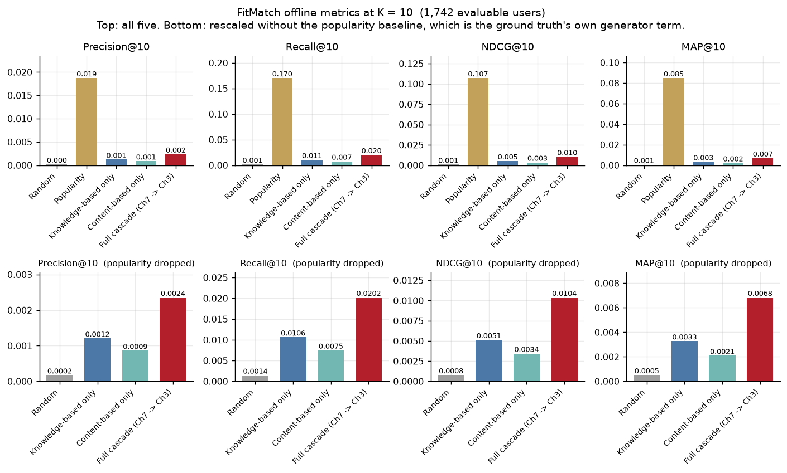
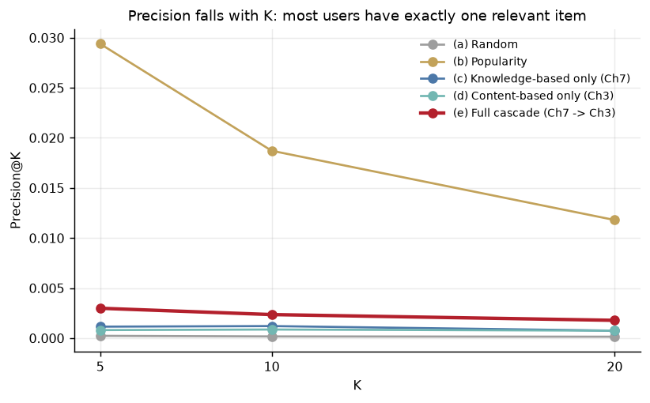
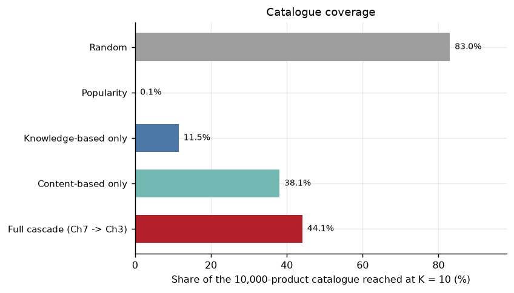
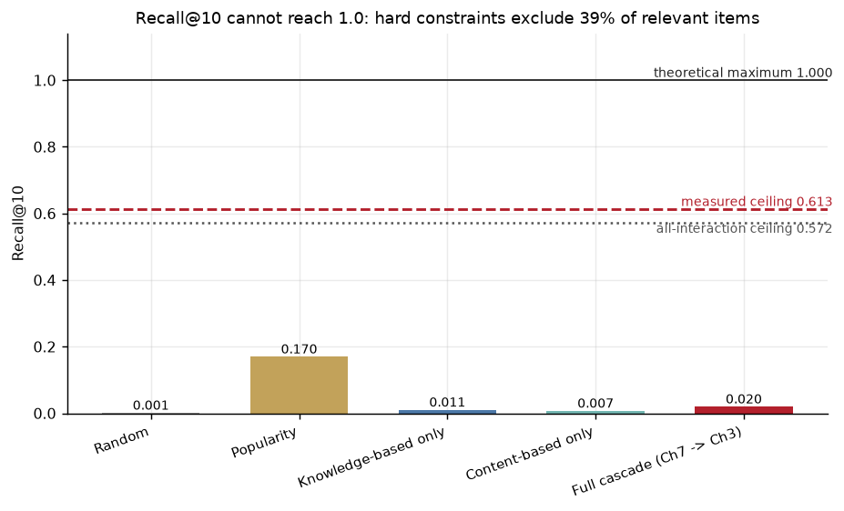
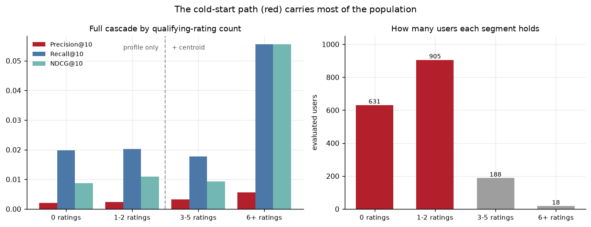
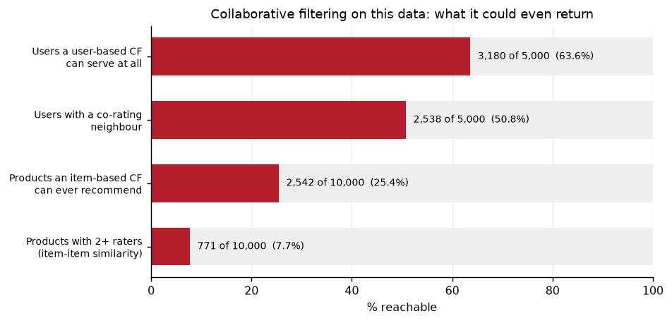

# FitMatch

A sportswear recommender that treats fit, budget and availability as
constraints rather than as features — and says out loud which of your
preferences it had to give up.

DS&RS 541 / CSX 4207 term project. Two techniques from the course list, kept in
separate modules and combined in a cascade, over a 10,000-product catalogue
built from four Kaggle datasets, served by a FastAPI backend and a React
frontend.

```
Profile in  ->  what is admissible (Ch7)  ->  what order (Ch3)  ->  10 products,
                                                                    each explained
```

---

## Contents

[Overview](#overview) · [The two techniques](#the-two-techniques) ·
[Architecture](#architecture) · [Data](#data) ·
[Setup](#setup-clone-to-running-app) · [Evaluation](#evaluation) ·
[Limitations](#limitations) · [Project layout](#project-layout)

---

## Overview

Buying sportswear is a constraint-satisfaction problem before it is a taste
problem. A shoe two sizes too small is not a *worse* recommendation than one in
the wrong colour — it is not a recommendation at all. Same for an item that is
out of stock, or priced past what you will spend, or made for a different body.

So FitMatch splits the question in two. A **knowledge-based constraint filter**
decides what is admissible, and a **content-based TF-IDF ranker** decides what
order the admissible things go in. Neither module imports the other; they meet
in one file.

The other half of the design is disclosure. Session 2 measured that the median
user in this dataset has **zero** products matching every preference they
stated, and that **98.7%** of users lose their colour preference before the
result set is usable. A system that quietly returns ten items anyway is
concealing something the shopper needs. Every response carries the relaxation
log — what was given up, in what order, and how many products it bought — and
the UI renders it in the API's own words.

**What you get:** a three-step profile builder, an explainable results page
where every item carries both a `[Ch7]` constraint reason and a `[Ch3]`
similarity reason, and a paginated catalogue browser. Every dropdown is
populated from the data at runtime; nothing about the vocabularies is hardcoded
in the frontend.

---

## The two techniques

### Chapter 7 — Knowledge-Based, Constraint-Based Recommendation

`src/recommender/knowledge_based.py`

Carries explicit domain knowledge as a filter and *relaxes* the negotiable
parts when the result set gets too thin. No training, no similarity.

**Hard constraints, never relaxed:**

| constraint | rule |
| --- | --- |
| budget | `budget_min <= price <= budget_max` |
| gender | `gender_target` matches the user, or is `unisex` |
| stock | `stock_status == "in_stock"` (so `low_stock` is excluded too) |
| sport | **footwear only**: `sport_type` is `primary_sport` or `lifestyle` |

**Soft constraints, relaxed cheapest-first until 50 products remain:**

```
color_preference -> material_preference -> arch_support
    -> seasonality -> preferred_brands -> size
```

Cosmetics go first; size goes last, because a shoe that does not fit is not a
recommendation. The order lives in one constant, `RELAXATION_ORDER`, so it can
be inspected and tested rather than buried in control flow.

**Why this technique.** It is the only one of the four on the course list that
can express "this does not fit". A similarity score cannot represent a hard
requirement — it can only rank an unfitting shoe slightly lower. It also needs
no interaction history at all, which matters enormously here (see below).

### Chapter 3 — Content-Based Filtering, TF-IDF + Cosine Similarity

`src/recommender/content_based.py`

Every product becomes a document: brand, category, subcategory, sport,
material, colour and the free-text description, plus engineered tokens
(`breathability_*`, `waterproof`, `season_*`, and footwear-only `cushion_*` /
`archsupport_*`). The user's profile becomes a document in the **same** 1,132-term
vocabulary. Score is the cosine of the angle between them.

| mode | when | how |
| --- | --- | --- |
| `profile_only` | fewer than 3 ratings of ≥ 4 | user vector from the stated profile |
| `profile_plus_centroid` | 3+ such ratings | profile blended 50/50 with the L2-normalised centroid of liked items |

**Why this technique, and why not collaborative filtering.** There are only
**7,939 ratings across 5,000 users** — a mean of 1.29 liked items each — so
**85.2% of users** never reach the centroid mode. Collaborative filtering has a
precondition this data cannot meet, and `src/evaluation/cold_start.py` measures
exactly how badly:

| precondition, measured on the training split | count | share |
| --- | ---: | ---: |
| users with no rating at all → CF returns **nothing** | 1,820 / 5,000 | 36.4% |
| users with no co-rating neighbour | 2,462 / 5,000 | 49.2% |
| products no one has rated → item-based CF can never recommend them | 7,458 / 10,000 | 74.6% |
| rating matrix density | — | 0.011% |

Content-based filtering has no such precondition: a product's document is its
own text, so all 10,000 products are rankable, including the 1,284 with zero
interactions.

### Why the cascade rather than a weighted hybrid

The two techniques answer different questions, so there is nothing to weight.
The filter has no opinion about order; the ranker has no notion of
admissibility. Running them in sequence needs no tuned blend parameter and
keeps both explainable — which is the whole point of picking a knowledge-based
technique in the first place.

---

## Architecture



**Request path at runtime:** browser → `POST /api/recommend` → `service.py`
→ `pipeline.recommend()` → `knowledge.filter()` (10,000 → ~194 median) →
`content.rank()` → response carrying items, per-item `[Ch7]` and `[Ch3]`
explanations, the relaxation log and the scoring mode → results page renders
the relaxation sentences **verbatim**.

---

## Data

Built from four Kaggle downloads placed in `data/raw/`. Filenames are matched
by glob, so a slightly different download name still works.

| File | Kaggle dataset | Used for |
| --- | --- | --- |
| `Nike_UK_2022-09-01.csv` | `polartech/nike-sportwear-product-dataset` | product names, prices, colourways, sizes, availability |
| `Adidas US Sales Datasets.xlsx` | `heemalichaudhari/adidas-sales-dataset` | per-segment price distribution, gender/category split, sales volume |
| `Sports_and_Outdoors_5.json` | `aarishasifkhan/sports-and-outdoor-review-dataset` | real star distribution and review text |
| `gym_members_exercise_tracking_synthetic_data.csv` | `nadeemajeedch/fitness-tracker-dataset` | user bodies and training habits |

### `products.csv` — 10,000 rows

Nike 5,219 · Adidas 4,000 · Jordan 781 | apparel 5,549 · footwear 3,923 · accessory 528

| column | type | domain / range | notes |
| --- | --- | --- | --- |
| `product_id` | str | `NK…` / `AD…`, unique | primary key |
| `brand` | str | Nike, Adidas, Jordan | |
| `category` | str | footwear, apparel, accessory | |
| `subcategory` | str | 29 values | irregular by design — `matching-sets`, `kits-and-jerseys` |
| `sport_type` | str | 10 sports | `lifestyle` is the sport-agnostic tier |
| `gender_target` | str | men, women, unisex | joins to `users.gender` via male→men |
| `price` | float | 8.83 – 1699.13 USD | Nike GBP converted at 1.27 |
| `discount` | float | 0.0 – 0.5 | |
| `stock_status` | str | in_stock (81.6%), low_stock, out_of_stock | |
| `size` | str | `US 10.5` / `XS`–`XXL` / `one-size` | **one value per row, not a stocked run** |
| `color` | str | 14 values | |
| `material` | str | 10 values | only 191 rows are `gore-tex` |
| `weight` | int | 34 – 831 g | |
| `cushioning_level` | int | 1 – 5 | `1` on apparel means *not applicable* |
| `arch_support` | str | low, medium, high | `medium` on apparel means *not applicable* |
| `breathability` | int | 1 – 5 | |
| `waterproof` | bool | 397 true | |
| `seasonality` | str | summer, winter, all-season | |
| `avg_rating` | float | 1.1 – 5.0 | |
| `review_count` | int | 0 – 13,211 | |
| `sales_rank` | int | 1 – 10,000 | **neither technique reads this** |
| `product_description` | str | free text | the largest TF-IDF contributor |

### `users.csv` — 5,000 rows

| column | type | domain / range | notes |
| --- | --- | --- | --- |
| `user_id` | str | `U00001`–`U05000` | primary key |
| `age` | int | 18 – 63 | from source |
| `gender` | str | male, female | from source |
| `height_cm` | float | 140.2 – 200.1 | recalibrated onto gender-specific marginals |
| `weight_kg` | float | 45.6 – 108.3 | recomputed so BMI agrees |
| `bmi` | float | 16.0 – 41.4 | `weight / height²` — validated |
| `shoe_size` | float | 5.0 – 14.0 | US sizing |
| `apparel_size` | str | XS – XXL | |
| `foot_arch_type` | str | low, normal, high | |
| `primary_sport` | str | 10 sports | from source workout type |
| `fitness_level` | str | beginner, intermediate, advanced | from source |
| `workouts_per_week` | int | 2 – 5 | from source |
| `indoor_or_outdoor` | str | indoor, outdoor, both | |
| `budget_min` / `budget_max` | int | 10–195 / 35–450 | `min < max` validated |
| `preferred_brands` | str | pipe-separated, 15 combinations | `"Nike\|Adidas"` |
| `style_preference` | str | performance, casual, athleisure, retro | **no product column** — keyword-mapped |
| `color_preference` | str | 14 values | relaxed for 98.7% of users |
| `material_preference` | str | 10 values | |
| `location` | str | 20 US metros | |
| `climate` | str | hot, tropical, temperate, continental, cold | drives seasonality |

### `interactions.csv` — 100,003 rows

view 62,385 · add_to_cart 20,292 · purchase 9,387 · rating 7,939

| column | type | notes |
| --- | --- | --- |
| `user_id` | str | → `users.user_id` |
| `product_id` | str | → `products.product_id`, 8,716 distinct |
| `event_type` | str | view, add_to_cart, purchase, rating |
| `timestamp` | str | 2024-03-03 → 2025-09-21 |
| `rating` | float | 1–5, **null on non-rating events** (92,064 nulls) |
| `review_text` | str | null except on rating events |

**This file is synthetic.** It was generated by scoring every user-product pair
on a hand-written fit function and sampling with a Zipf popularity prior. It is
properly non-uniform — top 1% of the catalogue takes 26.7% of interactions, top
10% takes 55.6%, Gini 0.682 — and plausibly aligned: 83.5% of interactions
match the user's sport or lifestyle, 93.6% are gender-compatible, 76.1% are
inside budget. The 1,284 untouched products are deliberate cold-start cases.

> **Read [`reports/circularity_note.md`](reports/circularity_note.md) before
> reading any accuracy number.** The generator and the recommender share
> fields: **all ten** Ch7 constraints and **five of eight** Ch3 user fields
> overlap. Offline metrics measure self-consistency, not real-world accuracy.

`python -m src.data.validate` runs **63 checks** — schema, id uniqueness,
controlled vocabularies, numeric ranges, `bmi == weight/height²`,
`budget_min < budget_max`, rating present on exactly the rating events, no
duplicate events, referential integrity both ways.

---

## Setup: clone to running app

**Prerequisites:** Python 3.11+, Node 20+. Windows commands below; everything
also works on macOS/Linux with the obvious substitutions.

> **`make` and `npx` do not work in this checkout.** `make` is not installed;
> `npx` fails because the absolute path contains a comma, which cmd.exe treats
> as an argument separator, so npm's generated `.bin` shims resolve to the
> wrong path. Every `package.json` script therefore calls
> `node node_modules/<pkg>/…` directly, so **`npm run <script>` works** and
> `npx <tool>` does not. The `.bat` files are the supported entry points.

### 1. Install

```bat
cd fitmatch
pip install -r requirements.txt
cd frontend && npm install && cd ..
```

### 2. Build the data

Place the four Kaggle downloads in `data/raw/`, then:

```bat
build_data.bat
```

<sub>or, one step at a time:</sub>

```bat
python -m src.data.build_products
python -m src.data.build_users
python -m src.data.build_interactions
python -m src.data.validate
```

This writes `data/processed/*.csv`. They are gitignored and reproducible
byte-for-byte from the same raw files — everything is seeded with 42.

### 3. Run it

```bat
run_demo.bat
```

**One command, the whole demo.** Starts the API, waits for
`GET /api/health` to report ready (a cold start refits TF-IDF and takes a
second or two; a warm start loads the joblib cache in ~200 ms), starts the
Vite dev server, and opens the browser. Each server gets its own window, so
closing a window stops that server. `run_demo.bat --no-open` skips the browser.

<sub>or, two terminals:</sub>

| what | command | URL |
| --- | --- | --- |
| API | `run_api.bat` | <http://127.0.0.1:8000/docs> |
| Frontend | `run_frontend.bat` | <http://localhost:5173> |

The frontend header carries a status dot for the backend, so a forgotten API
process is visible immediately rather than as four separate failures.

### 4. Everything else

| what | command |
| --- | --- |
| test suite | `run_tests.bat` (or `python -m pytest`); forwards args, so `run_tests.bat -k yoga` works |
| one recommendation | `python -m src.recommender.pipeline --user-id 42 --top-n 10` |
| demo script, 3 profiles | `python scripts/seed_demo.py` |
| feasibility report | `python -m src.recommender.audit` |
| offline evaluation | `python -m src.evaluation.evaluate` |
| cold-start analysis | `python -m src.evaluation.cold_start` |
| frontend checks | `cd frontend && npm run verify` (needs the API running) |
| frontend build | `cd frontend && npm run build` |

**On `--profile` and PowerShell.** PowerShell 5.1 strips the quotes out of a
JSON argument before the process sees it, so
`--profile '{"primary_sport": "yoga"}'` — the form every tutorial shows — fails
here. Use the `key=value` form, which survives every shell:

```bat
python -m src.recommender.pipeline --profile primary_sport=yoga,budget_max=90
```

### The demo script

`python scripts/seed_demo.py` runs three contrasting personas and prints, for
each, the top 5 with scores, the full relaxation log and the scoring mode — the
text is written to be read aloud. It then asserts that the three actually
return different products:

```
  budget_runner vs outdoor_athlete        0 shared of top 5   OK
  budget_runner vs nike_gym               0 shared of top 5   OK
  outdoor_athlete vs nike_gym             0 shared of top 5   OK

  15 distinct products across 3 profiles x top 5 = 15 slots
```

The three: a budget-conscious beginner runner ($35–70, no brand loyalty), an
advanced outdoor athlete ($150–400, gore-tex), and an intermediate indoor gym
user (Nike only, performance). They return all-Adidas, all-Nike outdoor, and
all-Nike training respectively, and each relaxes a different constraint.
`--json` prints them as `POST /api/recommend` bodies.

---

## Evaluation

`python -m src.evaluation.evaluate` — leave-latest-out split per user by
timestamp (most recent 20% held out), relevance = `rating >= 4`, 1,742
evaluable users holding 1,988 relevant items. Five configurations at K = 5, 10,
20. Writes `reports/evaluation_results.csv` and the figures below.

### Results at K = 10

| configuration | P@10 | R@10 | R@10 ÷ ceiling | NDCG@10 | MAP@10 | Coverage |
| --- | ---: | ---: | ---: | ---: | ---: | ---: |
| (a) Random | 0.0002 | 0.0014 | 0.002 | 0.0008 | 0.0005 | 83.0% |
| (b) Popularity | **0.0187** | **0.1702** | **0.278** | **0.1072** | **0.0848** | 0.1% |
| (c) Knowledge-based only (Ch7) | 0.0012 | 0.0106 | 0.017 | 0.0051 | 0.0033 | 11.5% |
| (d) Content-based only (Ch3) | 0.0009 | 0.0075 | 0.012 | 0.0034 | 0.0021 | 38.1% |
| (e) **Full cascade (Ch7 → Ch3)** | 0.0024 | 0.0202 | 0.033 | 0.0104 | 0.0068 | 44.1% |



**The cascade beats both of its own halves.** At K=10 it doubles the constraint
filter alone and nearly triples the content ranker alone on precision, and
beats random by 14×. That ordering is the result worth having: filtering and
ranking contribute separately, and the combination is worth more than either —
which is what the architecture predicts. It also reaches 44.1% of the catalogue
against the filter's 11.5%, because the ranker spreads demand across the
feasible set instead of returning its head.



**Popularity wins, and that is bad news, not good.** It is not evidence that
popularity is a good recommender — it is evidence that popularity *generated
the ground truth*. The Zipf prior on `sales_rank` was the largest term in the
interaction generator; the 100 best-selling products average 241 interactions
each against 2.2 for the 100 worst. Neither FitMatch technique reads
`sales_rank` at any point, by design. The popularity row measures agreement
with the generator, which it has by construction, while serving **the same ten
products to all 1,742 users** — 0.1% catalogue coverage.

> This was predicted in `circularity_note.md` *before* the evaluation was
> written: *"Ranking every feasible product by `sales_rank` should score very
> well against this log, because popularity is what generated it."*



### The recall ceiling



Hard constraints are never relaxed, so they exclude items the user
demonstrably interacted with and rated highly. **Recall@K cannot reach 1.0**:

| ceiling | value | scope |
| --- | ---: | --- |
| all interactions | 0.572 | `feasibility_report.md` §3, all 100,003 events |
| rated interactions | 0.603 | same source, the 7,939 ratings |
| **this evaluation, measured** | **0.613** | held-out `rating >= 4` items only |

Sharper still: for **625 of 1,742 evaluable users (35.9%)**, *every* relevant
held-out item is blocked by a hard constraint. Their maximum achievable recall
is **0.000** for any configuration that respects those constraints, however
good the ranking. This is correct behaviour — an out-of-stock shoe over budget
is not a recommendation — but it means raw recall understates the ranker by a
large, quantified margin.

### Cold start

`python -m src.evaluation.cold_start` — segments by qualifying rating count and
independently reproduces the 85.2% figure (4,258 of 5,000 users).

| segment | Ch3 mode | users | share |
| --- | --- | ---: | ---: |
| 0 ratings | profile only | 1,523 | 30.5% |
| 1–2 ratings | profile only | 2,735 | 54.7% |
| 3–5 ratings | profile + centroid | 675 | 13.5% |
| 6+ ratings | profile + centroid | 67 | 1.3% |
| **cold start total** | **profile only** | **4,258** | **85.2%** |



Grouped by scoring mode, the profile-only path serves 1,536 of 1,742 evaluated
users and reaches **0.95x the warm path's recall**, 0.75× its NDCG and 0.65× its
precision. The precision gap is real and in the expected direction — three
ratings do add signal — but the warm segment is only 206 users, 18 of whom sit
in the 6+ bucket where one extra hit moves the average visibly. The path
degrades gracefully rather than failing.



Which is the point: collaborative filtering would not have degraded here, it
would have returned **nothing** for 36.4% of users.

---

## Limitations

**1. Circularity undercuts every accuracy number above.** `interactions.csv`
was synthesised by a fit function reading twelve product fields; the
recommender reads many of the same ones. All ten Ch7 constraints correspond to
a generator term, and five of eight Ch3 user fields do. Precision and recall
against that log quantify how closely two hand-written rule sets agree — not
how well the system would serve a real shopper. Field-by-field enumeration in
[`reports/circularity_note.md`](reports/circularity_note.md). The
*non-circular* evidence — coverage, cold-start reach, constraint-satisfaction
rate, and the fact that all 1,010 in-stock zero-interaction products stay
reachable — is the part that means what it appears to mean.

**2. The recall ceiling, pushing the other way.** 61.3% measured; 35.9% of
evaluable users have a ceiling of exactly zero. See above.

**3. The evaluation's own methodology needed adjusting.** The usual convention
of excluding already-seen items is wrong for this log: the generator emits a
funnel (view → add_to_cart → purchase → rating) over a *single product*, so the
earlier events land in training while the rating lands in the held-out half.
Applying the convention removes **69.4%** of relevant held-out items and drives
every configuration to precision exactly 0.0000. Training items are therefore
not excluded; `--exclude-seen` reproduces the other convention.

**4. Thin, lopsided labels.** Most evaluable users have exactly one relevant
held-out item, so recall@K is nearly a hit rate and averages are sensitive to
single hits. Relevance is binary, so NDCG does not distinguish 5★ from 4★. And
the cold-start share among evaluable users is 88.2% — *higher* than the
population's 85.2% — precisely because leave-latest-out removes the recent
ratings that would have qualified them.

**5. Known weaknesses in the system itself.** `style_preference` has no
catalogue column and is keyword-mapped; an early version made a *running*
profile return 19/20 training shoes because style tokens outvoted
`primary_sport` (no keyword map may now reuse a `sport_type` value, and a test
enforces it). `products.size` holds one value per row rather than a stocked
run, which is why size is a tolerant soft constraint rather than a hard one.
And the cascade is one-directional: the filter cannot reconsider once the
ranker has seen the result, so a shopper whose budget admits 50 products gets a
ranking over 50 products with no hint that $20 more would open the catalogue
considerably.

---

## Project layout

```
fitmatch/
  data/raw/          four Kaggle downloads (not in version control)
  data/processed/    products.csv, users.csv, interactions.csv
  data/cache/        fitted TF-IDF model (joblib, rebuilt on demand)
  src/data/          build scripts + 63-check validator
  src/recommender/   knowledge_based.py (Ch7), content_based.py (Ch3), pipeline.py
  src/api/           FastAPI over the cascade — 6 endpoints
  src/evaluation/    evaluate.py, cold_start.py
  frontend/          React + Vite + TypeScript + Tailwind
  scripts/           seed_demo.py, wait_for_api.py
  tests/             pytest suite
  reports/           circularity_note.md, feasibility_report.md,
                     technical_summary.md, evaluation_results.csv, figures/
  build_data.bat     build the three CSVs
  run_demo.bat       API + frontend + browser, one command
  run_api.bat        API only
  run_frontend.bat   frontend only
  run_tests.bat      pytest, forwards arguments
  requirements.txt
```

**API endpoints:** `POST /api/recommend`, `GET /api/products`,
`GET /api/products/{id}`, `GET /api/users/{id}`, `GET /api/meta`,
`GET /api/health`. Pydantic v2 validates every request against vocabularies
measured from the CSVs at startup — nothing is hardcoded.

**Determinism.** Every script is seeded with 42, and the recommender draws no
random numbers at all: ties break on `product_id`, so the same profile always
gives the same ranking on every machine. The only RNG in the project is the
data build and the evaluation's random baseline.

### Further reading

| document | what it covers |
| --- | --- |
| [`reports/technical_summary.md`](reports/technical_summary.md) | the write-up: problem, technique choice, cascade, provenance, findings, limitations |
| [`reports/circularity_note.md`](reports/circularity_note.md) | which scoring features overlap the interaction generator, field by field |
| [`reports/feasibility_report.md`](reports/feasibility_report.md) | feasible-set sizes, per-sport coverage, what hard filtering costs |
| [`frontend/README.md`](frontend/README.md) | the React app |
